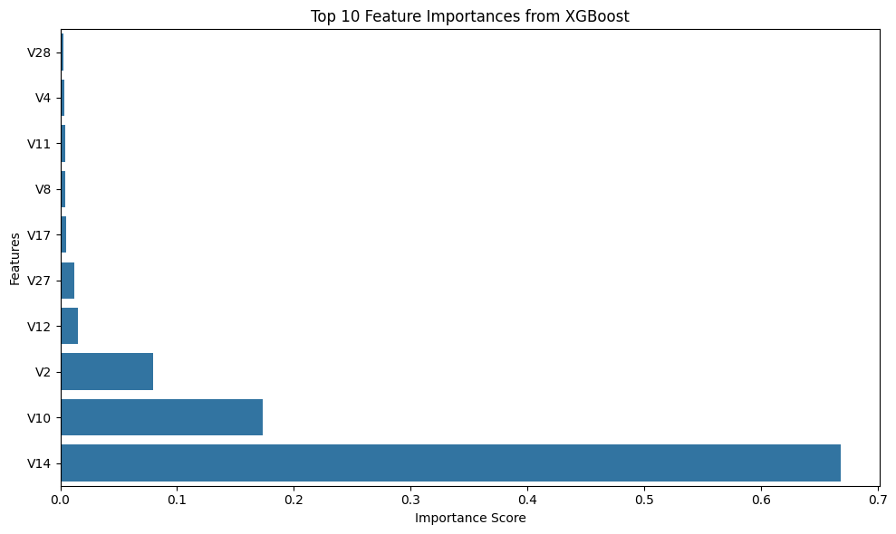
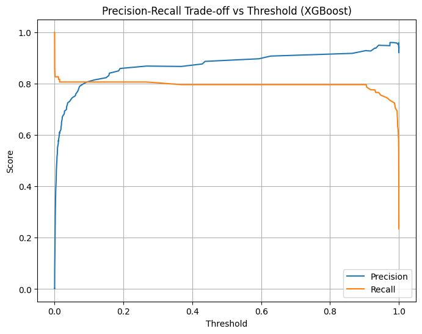
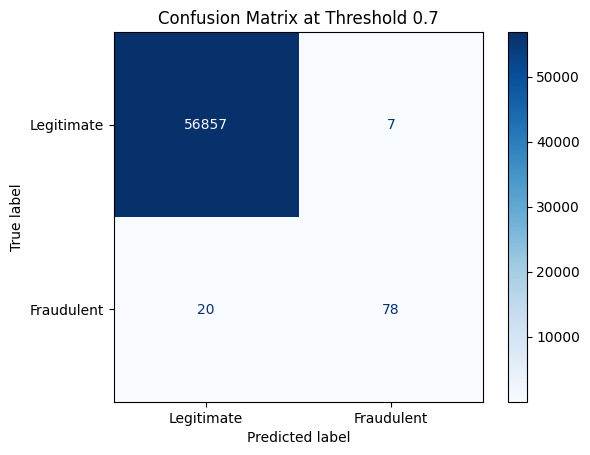

# Credit Card Fraud Detection

A machine learning project analyzing transaction data to detect fraudulent credit card transactions, with a focus on handling extreme class imbalance and translating model performance into business-relevant decisions.

## Problem

Fraud detection is a needle-in-a-haystack problem: in this dataset, only **0.17% of transactions (492 out of 284,807)** are fraudulent. A model that simply predicted "not fraud" every time would be 99.8% accurate — which makes accuracy a useless metric here. The real challenge is building a model that reliably catches fraud without generating so many false alarms that it becomes unusable in practice.

## Dataset

- Source: [Kaggle — Credit Card Fraud Detection](https://www.kaggle.com/mlg-ulb/creditcardfraud)
- 284,807 transactions over 48 hours, made by European cardholders
- Features: `V1`–`V28` (anonymized via PCA), `Time`, `Amount`, and `Class` (target: 0 = legitimate, 1 = fraud)
- No missing values

## Exploratory Data Analysis

Key findings before modeling:

- **Class imbalance:** 492 fraud vs. 284,315 legitimate transactions (0.17%)
- **Amount:** Fraudulent transactions skew toward small "testing" amounts, with a secondary cluster near $100
- **Timing:** Fraud disproportionately occurs during low-volume overnight hours, while legitimate transactions follow a normal daily rhythm — a genuine behavioral signal
- **Most separating features:** `V17`, `V14`, `V12`, `V10`, `V16`, `V3` showed the clearest distributional separation between fraud and legitimate transactions

## Methodology

1. **Preprocessing:** Scaled `Time` and `Amount` with `StandardScaler` (the only unscaled features, since `V1`–`V28` were already PCA-transformed)
2. **Train/test split:** Stratified 80/20 split to preserve the 0.17% fraud ratio in both sets
3. **Baseline model:** Logistic Regression
4. **Imbalance handling:** Compared class weighting and SMOTE (synthetic oversampling) against the baseline
5. **Advanced model:** XGBoost, evaluated with and without threshold tuning
6. **Threshold tuning:** Used the precision-recall curve to select a threshold that improves precision without sacrificing recall
7. **Evaluation:** Precision, recall, F1-score, and confusion matrix — not accuracy, given the imbalance

## Results

| Model | Precision (fraud) | Recall (fraud) | F1-score (fraud) |
|---|---|---|---|
| Logistic Regression (baseline) | 0.83 | 0.64 | 0.72 |
| Logistic Regression (class weighted) | 0.06 | 0.92 | 0.11 |
| Logistic Regression (SMOTE) | 0.06 | 0.92 | 0.11 |
| XGBoost (default threshold 0.5) | 0.90 | 0.80 | 0.84 |
| **XGBoost (tuned threshold 0.7)** | **0.92** | **0.80** | **0.85** |

**Key finding:** Balancing techniques (SMOTE, class weights) significantly improved recall for logistic regression but destroyed precision, making the model impractical (94% false alarm rate on flagged transactions). XGBoost, a tree-based model capable of capturing non-linear patterns, outperformed all logistic regression variants without requiring any balancing — and improved further with threshold tuning.

### Feature importance

XGBoost's most influential features were `V14`, `V10`, and `V2` — consistent with the strongest signals identified during EDA, validating that the model learned genuine patterns rather than noise.

### Threshold tuning

The precision-recall curve below shows that recall stays flat (~0.80) across a wide range of thresholds while precision keeps climbing — meaning the threshold could be raised well past the default 0.5 with little to no cost in missed fraud.

### Final model: confusion matrix (threshold = 0.7)

| | Predicted Legitimate | Predicted Fraud |
|---|---|---|
| **Actual Legitimate** | 56,857 | 7 |
| **Actual Fraud** | 20 | 78 |

At this threshold, the model catches **80% of fraud (78/98)** while incorrectly flagging only **7 out of 56,864 legitimate transactions** — a false-alarm rate of roughly 0.01%.

## Business interpretation

In a real deployment, the cost of a missed fraud case (direct financial loss, chargebacks) is typically far higher than the cost of a false alarm (a re-confirmation step, minor customer friction). The tuned XGBoost model at threshold 0.7 reflects that trade-off: it prioritizes catching fraud while keeping false positives extremely low, making it a practical candidate for production use — pending further tuning against actual cost estimates from the business.

## Tech stack

- **Python:** pandas, numpy
- **Modeling:** scikit-learn, XGBoost, imbalanced-learn (SMOTE)
- **Visualization:** matplotlib, seaborn

## Possible next steps

- Test XGBoost combined with SMOTE/class weighting to see if recall can be pushed further without repeating logistic regression's precision collapse
- Cross-validation instead of a single train/test split, for more robust performance estimates
- Deploy as a simple Streamlit app for interactive threshold exploration

## Acknowledgments

Built with guidance from Claude (Anthropic) — used as a step-by-step mentor to work through modeling decisions, understand the reasoning behind each technique, and interpret results, rather than to generate the analysis wholesale.
